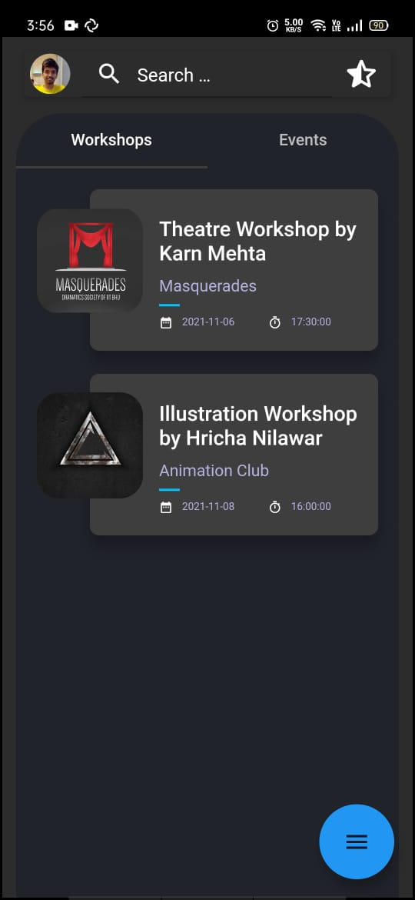
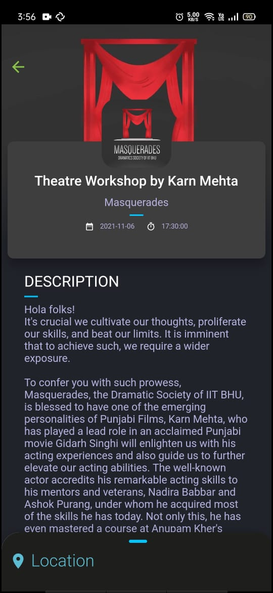
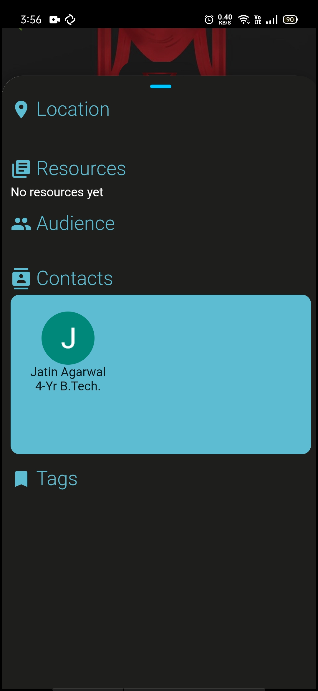

# IIT-BHU-app

   

*(This README might contains various TODO comments like this one as this file is under development. So if you are helping with the development of the app, be sure to look for comments like this one. Also, feel free to make a PR if you find features integrated in the app, but not mentioned here. Once all work is done, we can remove this comment 😀)*

**Note: We prefer not more than `80` characters per line, for better code readability. So if you are using VSCode, do make sure to include the following in your global settings for dart.**

```json
"editor.rulers": [80],
```

## Folder structure

Like in any other flutter project, the `lib` folder contains majority of code, divided as follows:

* **main.dart** : is the main file from where execution begins.
* **data**: connectivity and API calls are provided here.
* **external_libraries**: all code for external libraries are provided here.
* **model** : deals with local database management, serializers, etc.
* **pages** : All the pages mentioned in the `main.dart` file are routed to this folder. It contains the layout of these pages.
* **screen** : elements of logic for the pages are provided here.
* **ui** : contains UI elements like dialog boxes, separators, custom widgets, etc common to various pages. 


## Contributing

Contributions are welcome! 
However, if it's going to be a major change, please create an issue first. 
Before starting to work on something, please comment on a specific issue and say you'd like to work on it.

## Some clean code guidelines : -

1. All the constructor of stateless or stateful widget will be const and therefore all the fields will be "final".
   (so that they are always immutable within the class, for mutable objects use stateful classes)

2. All variables in State<SomeClass> should be private. (append "_" to every variable name at start).

3. Any function or custom widget will take parameterized arguments if no. of arguments are more than 1.
   Add @required for necessary parameters.

4. Don't be scared of big named classes and file names. Name each file/variable/class/enum/function/custom widget , whatever you define, crystal clear according to their abstract.

5. Categorize your work in terms of independent features and then put their files in a folder so that code can be organized and transparent.

6. Use "TODO:" as much as you can, if you're leaving a code incomplete or unfinished there must be a TODO: above it telling what is left to be done.

7. Break large widget trees into chunks of small widget trees where each small widget tree behaves independently and is significant for custom purposes. (for eg. we won't separate padding widget but a custom purpose ListView.builder can be separated)

8. For flutter, always use lowerCamelCase for naming variables & functions and UpperCamelCase for naming classes. (not mandatory but lets just be standard so that code is readable to everybody)
 


